# Keshav Prasad

**Full Stack Developer** · Final-year B.Tech CSE @ IIIT Naya Raipur '27

---

## About

Final-year Computer Science undergrad at **IIIT Naya Raipur** (2023–2027). I build full stack systems end to end — and I care most about the parts that only show up under load: concurrent writes, cache behaviour, and tests that try to break invariants rather than just cover lines.

Previously a **Full Stack Developer intern at Elevance Skills**, where I shipped features on a production platform used by real users.

- 🎯 **Open to SDE / Full Stack roles** — 2027 graduate
- 💼 Ex-Intern, Full Stack Developer @ Elevance Skills
- 🧠 Active competitive programmer — LeetCode 1748, Codeforces Pupil (1207), CodeChef 1669
- 💬 Ask me about: system design, API design, MongoDB internals, DSA

---

## Featured Projects

### ⚡ [SnapCDN](https://github.com/Keshavsspppp/SnapCDN) — Three-tier image CDN

A self-hosted content delivery layer for images, built to cut cold-path latency to near-zero on repeat requests.

- **Three-tier cache hierarchy** — in-memory → disk → origin, so hot assets never touch the slow path
- **Cut p50 latency from ~1.6s to ~3ms** on cached reads
- **Security-hardened** — validated uploads, signed access, and protection against path traversal on the storage layer
- Designed around cache-key correctness so stale or poisoned entries can't be served

`Node.js` · `TypeScript` · `Caching` · `Image Processing`

---

### 🏬 [darkstore-allocation-engine](https://github.com/Keshavsspppp/darkstore-allocation-engine) — Quick-commerce order allocation

Given a customer location and a cart, finds the nearest dark store that can fulfil the **entire** order and reserves the stock — without ever overselling.

- **Geospatial discovery** — MongoDB `$geoNear` over a 2dsphere index returns in-radius stores pre-sorted by distance
- **Atomic reservation** — `findOneAndUpdate` with stock guards decrements inventory in one operation, so concurrent orders can't claim the same unit
- **Full-cart availability scan** — candidates checked nearest-first; partial fulfilment rejected before any write
- **Property-based testing** with `fast-check` plus integration tests on `mongodb-memory-server`

`Node.js` · `TypeScript` · `Express` · `MongoDB` · `Zod` · `Jest` · `fast-check`

---

### 📋 [Trackerr](https://github.com/Keshavsspppp/Trackerr) — Job application tracker

Tracks an application from first apply to offer. Built as a real product — deployed, authenticated, with a background job that nudges you about applications going stale.

- **Google OAuth via NextAuth** with stateless JWT sessions — no DB lookup per request, scales horizontally
- **Automated stale-application reminders** — Vercel Cron hits a secret-protected endpoint daily, emails via Resend for anything untouched 7+ days
- **Server-side dashboard aggregation** — per-status breakdown and interview-rate stats in Server Components
- **50 tests across 7 files** — unit plus property-based tests using `fast-check`

`Next.js 16` · `TypeScript` · `MongoDB Atlas` · `NextAuth.js` · `Resend` · `Vercel Cron` · `Vitest`

---

### 🗄️ [PolyCache](https://github.com/Keshavsspppp/PolyCache) — Pluggable cache eviction library

A small library for comparing eviction strategies rather than committing to one — built to answer "which policy actually fits this access pattern?"

- **Strategy pattern** over LRU, LFU, and FIFO eviction, swappable at runtime
- Benchmarking harness that surfaced a **~49-point hit-ratio divergence** between policies under a skewed access pattern
- Designed as a teaching/reference implementation of classic eviction algorithms, not just a single-policy cache

`TypeScript` · `Data Structures` · `Benchmarking`

---

### 📈 [StockGuard](https://github.com/Keshavsspppp/StockGuard) — Inventory monitoring platform

A Django-backed system for tracking stock levels and surfacing alerts before shortages happen.

- **Django REST Framework** API with PostgreSQL for persistence
- **Celery + Redis** for background/async alerting jobs
- React frontend consuming the DRF API

`Django` · `Django REST Framework` · `PostgreSQL` · `Celery` · `Redis` · `React`

*More on the [repositories tab](https://github.com/Keshavsspppp?tab=repositories) →*

---

## Tech Stack

**Languages**

**Frontend**

**Backend**

**Databases**

**Tools**

---

## Competitive Programming

C++ is my contest language. Regular practice is where the instinct for edge cases and complexity trade-offs in the projects above comes from.

| Platform | Handle | Rating |
|---|---|---|
| [LeetCode](https://leetcode.com/u/vCtAUvUZ5B/) | `vCtAUvUZ5B` | **1748** contest rating |
| [CodeChef](https://www.codechef.com/users/keshavssp04) | `keshavssp04` | **1669** highest |
| [Codeforces](https://codeforces.com/profile/keshavssp04) | `keshavssp04` | **1207** — Pupil |

---

## Contribution Snake

<picture>
  <source media="(prefers-color-scheme: dark)" srcset="https://raw.githubusercontent.com/Keshavsspppp/Keshavsspppp/output/github-contribution-grid-snake-dark.svg" />
  <source media="(prefers-color-scheme: light)" srcset="https://raw.githubusercontent.com/Keshavsspppp/Keshavsspppp/output/github-contribution-grid-snake.svg" />
  
</picture>

---

## GitHub Stats

---

**Open to SDE / Full Stack opportunities** — reach me on [LinkedIn](https://www.linkedin.com/in/keshavprasad-ai/) or at keshavssp04@gmail.com

